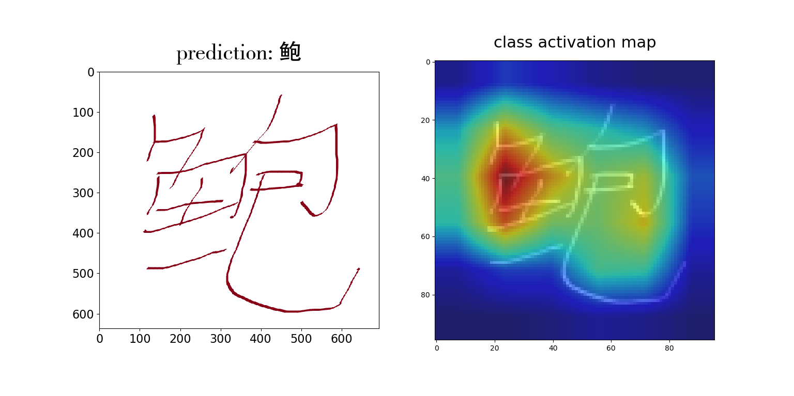

# Offline Handwritten Chinese Character Classifier
## Description:

- recognizes isolated handwritten Chinese characters among 3755 classes of GB2312-80 level-1 standard;

- based on a CNN called Melnyk-Net [[Melnyk et al, “A High-Performance CNN Method for Offline Handwritten Chinese Character Recognition and Visualization”, 2018]](https://arxiv.org/abs/1812.11489);

- implemented using the amazing Keras library with the TensorFlow backend: 


```
_________________________________________________________________
Layer (type)                 Output Shape              Param #
=================================================================
input_1 (InputLayer)         (None, 96, 96, 1)         0
_________________________________________________________________
conv2d_1 (Conv2D)            (None, 96, 96, 64)        576
_________________________________________________________________
batch_normalization_1 (Batch (None, 96, 96, 64)        256
_________________________________________________________________
activation_1 (Activation)    (None, 96, 96, 64)        0
_________________________________________________________________
conv2d_2 (Conv2D)            (None, 96, 96, 64)        36864
_________________________________________________________________
batch_normalization_2 (Batch (None, 96, 96, 64)        256
_________________________________________________________________
activation_2 (Activation)    (None, 96, 96, 64)        0
_________________________________________________________________
average_pooling2d_1 (Average (None, 48, 48, 64)        0
_________________________________________________________________
conv2d_3 (Conv2D)            (None, 48, 48, 96)        55296
_________________________________________________________________
batch_normalization_3 (Batch (None, 48, 48, 96)        384
_________________________________________________________________
activation_3 (Activation)    (None, 48, 48, 96)        0
_________________________________________________________________
conv2d_4 (Conv2D)            (None, 48, 48, 64)        55296
_________________________________________________________________
batch_normalization_4 (Batch (None, 48, 48, 64)        256
_________________________________________________________________
activation_4 (Activation)    (None, 48, 48, 64)        0
_________________________________________________________________
conv2d_5 (Conv2D)            (None, 48, 48, 96)        55296
_________________________________________________________________
batch_normalization_5 (Batch (None, 48, 48, 96)        384
_________________________________________________________________
activation_5 (Activation)    (None, 48, 48, 96)        0
_________________________________________________________________
average_pooling2d_2 (Average (None, 24, 24, 96)        0
_________________________________________________________________
conv2d_6 (Conv2D)            (None, 24, 24, 128)       110592
_________________________________________________________________
batch_normalization_6 (Batch (None, 24, 24, 128)       512
_________________________________________________________________
activation_6 (Activation)    (None, 24, 24, 128)       0
_________________________________________________________________
conv2d_7 (Conv2D)            (None, 24, 24, 96)        110592
_________________________________________________________________
batch_normalization_7 (Batch (None, 24, 24, 96)        384
_________________________________________________________________
activation_7 (Activation)    (None, 24, 24, 96)        0
_________________________________________________________________
conv2d_8 (Conv2D)            (None, 24, 24, 128)       110592
_________________________________________________________________
batch_normalization_8 (Batch (None, 24, 24, 128)       512
_________________________________________________________________
activation_8 (Activation)    (None, 24, 24, 128)       0
_________________________________________________________________
average_pooling2d_3 (Average (None, 12, 12, 128)       0
_________________________________________________________________
conv2d_9 (Conv2D)            (None, 12, 12, 256)       294912
_________________________________________________________________
batch_normalization_9 (Batch (None, 12, 12, 256)       1024
_________________________________________________________________
activation_9 (Activation)    (None, 12, 12, 256)       0
_________________________________________________________________
conv2d_10 (Conv2D)           (None, 12, 12, 192)       442368
_________________________________________________________________
batch_normalization_10 (Batc (None, 12, 12, 192)       768
_________________________________________________________________
activation_10 (Activation)   (None, 12, 12, 192)       0
_________________________________________________________________
conv2d_11 (Conv2D)           (None, 12, 12, 256)       442368
_________________________________________________________________
batch_normalization_11 (Batc (None, 12, 12, 256)       1024
_________________________________________________________________
activation_11 (Activation)   (None, 12, 12, 256)       0
_________________________________________________________________
average_pooling2d_4 (Average (None, 6, 6, 256)         0
_________________________________________________________________
conv2d_12 (Conv2D)           (None, 6, 6, 448)         1032192
_________________________________________________________________
batch_normalization_12 (Batc (None, 6, 6, 448)         1792
_________________________________________________________________
activation_12 (Activation)   (None, 6, 6, 448)         0
_________________________________________________________________
conv2d_13 (Conv2D)           (None, 6, 6, 256)         1032192
_________________________________________________________________
batch_normalization_13 (Batc (None, 6, 6, 256)         1024
_________________________________________________________________
activation_13 (Activation)   (None, 6, 6, 256)         0
_________________________________________________________________
conv2d_14 (Conv2D)           (None, 6, 6, 448)         1032192
_________________________________________________________________
batch_normalization_14 (Batc (None, 6, 6, 448)         1792
_________________________________________________________________
activation_14 (Activation)   (None, 6, 6, 448)         0
_________________________________________________________________
global_weighted_average_pool (None, 448)               16128
_________________________________________________________________
dropout_1 (Dropout)          (None, 448)               0
_________________________________________________________________
dense_1 (Dense)              (None, 3755)              1685995
=================================================================
Total params: 6,523,819
Trainable params: 6,518,635
Non-trainable params: 5,184
```


- Trained on CASIA-HWDB1.0-1.1 datasets collected by National Laboratory of Pattern Recognition (NLPR), Institute of Automation of Chinese Academy of Sciences (CASIA), written by 420 and 300 persons. The overall training dataset contains 2,678,424 samples.

- Evaluated on the most common benchmark – ICDAR-2013 competition dataset containing 224,419 samples written by 60 persons.

- **Model accuracy** - 97.61%.

- **Total number of parameters** - 6,523,819 (~24.9 MB of storage).

## Dependencies:
Python3, tensorflow 1.7, keras 2.1.6, scipy, numpy, matplotlib, pandas, pyplotz, glob, struct, h5py

## Usage:
 - before using the application, please download [Melnyk-Net](https://drive.google.com/open?id=1s8PQo7CKpOGdo-eXwtYeweY8-yjs7RYp) and place it in the directory with the other files (don't rename it);
 - run 'main.py';
 - follow the prompt instructions:
    - specify the isolated character image/images directory (e.g. 'images'; it will upload all the images from this folder);
       supports both b&w and colorful images;
    - specify the number of candidates for recognition, *n*, - the program will show *n* most confident predictions per each character image.
    

## Demo:


```
$ main.py

---------- Offline Handwritten Chinese Character Recognizer ----------

Based on the convolutional neural network called Melnyk-Net.
Recognizes 3755 Chinese character classes from GB2312-80 level-1.

Copyright © 2018 Pavlo O. Melnyk


Show Melnyk-Net summary? [Y/n]
n


Please specify data filepath:
images\鲍.png

Loading the data.....................................


Please specify number of predictions per input image:
5

Melnyk-Net response:

Dear User, I am 99.986 % sure it's     鲍
Dear User, I am 0.011 % sure it's     鸵
Dear User, I am 0.001 % sure it's     跑
Dear User, I am 0.001 % sure it's     鳃
Dear User, I am 0.000 % sure it's     鲸

Continue? [Y/n]
n

Thanks for using Melnyk-Net Offline HCCR software!
```

## Credits:
The functions *normalize_bitmap*, *tagcode_to_unicode* and *unicode_to_tagcode*
are written by Alessandro and Francesco https://github.com/integeruser/CASIA-HWDB1.1-cnn
